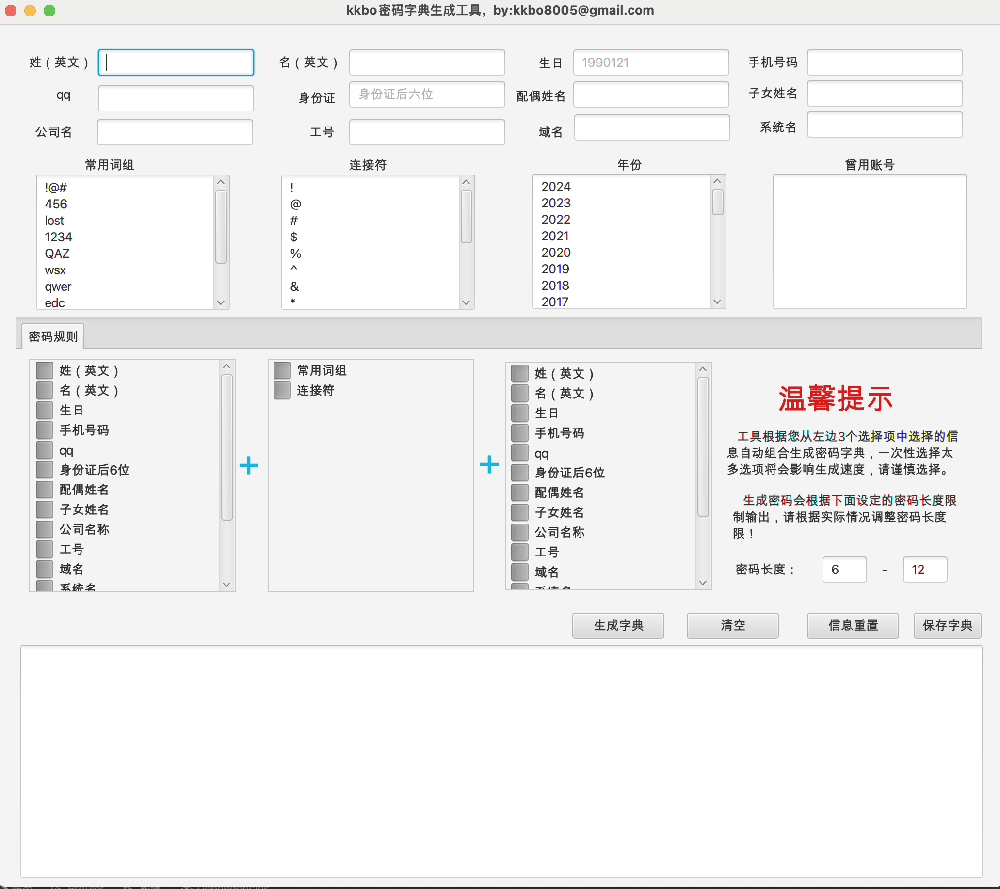

**本工具仅供安全测试人员运用于授权测试, 禁止用于未授权测试, 违者责任自负。**

## 简介


该工具是使用javaFX开发的基于信息收集进行组合生成密码字典的工具，可以快速组成密码字典。


## 使用说明


直接下载releases版本即可

**使用JDK8启动，命令如下：**

```
java -jar dicttools-1.0-SNAPSHOT.jar 
```



## 免责声明


该开源工具是由作者按照开源许可证发布的，仅供个人学习和研究使用。作者不对您使用该工具所产生的任何后果负任何法律责任。

## 特别鸣谢

本工具开发过程中参考过网上的大佬的文章，在此表示感谢！

特别感谢**长风安全（sik)**、**湘安无事-湘南第一深情** ，对于工具的完善提供了很多建议和帮助。大家多多关注他们的公众号与知识星球。

更多完善建议和技术交流可以加v:**kkbo680** ，谢谢。